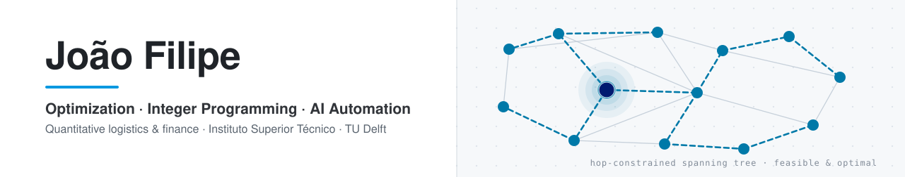

  <picture>
    <source media="(prefers-color-scheme: dark)" srcset="assets/hero-dark.svg">
    <source media="(prefers-color-scheme: light)" srcset="assets/hero-light.svg">
    
  </picture>

  
  
  
  

I build decision systems: I take an operational problem, write it down as a model, solve it with the right
tool — an exact formulation when the problem admits one, a heuristic when it does not — and then ship the
result into something a person actually uses. MSc in Industrial Engineering and Management at
**Instituto Superior Técnico**, currently on exchange in Complex Systems Engineering and Management at
**TU Delft**.

Most of my work sits in one of four places: **integer programming and network design**, **supply-chain and
logistics optimization**, **quantitative finance and market simulation**, and — increasingly — **automating
the document-heavy operational work** that surrounds all three.

---

## Selected work

| Project | What it demonstrates | Stack |
|---|---|---|
| [Hop-constrained spanning trees](https://github.com/joaofilipe5/hop-constrained-spanning-tree) | Network design under a bound on root-to-node hops: an exact MILP alongside a constructive tree-repair heuristic, compared on generated instances | Python · PuLP/CBC · NetworkX |
| [Green hydrogen supply chain](https://github.com/joaofilipe5/GCAProject) | National-scale MIP: facility location, renewable allocation, storage, transport and investment timing, with a sensitivity study over the cost drivers | Python · PuLP/CBC · Sensitivity analysis |
| [Travelling purchaser visualizer](https://github.com/joaofilipe5/top-visualizer) | Joint purchasing and routing decisions made visible — construction heuristics and local search you can step through in the browser | React · TypeScript · Heuristics |
| [Justice operations: ML + allocation](https://github.com/joaofilipe5/PIC) | Forecasting completed court cases, then feeding those forecasts into an integer staff-allocation model | Python · Gurobi · Regression &amp; ensembles |

| Project | What it demonstrates | Stack |
|---|---|---|
| [Limit order book simulation](https://github.com/joaofilipe5/limit-order-book-simulation) | A discrete-event matching engine plus analysis of the order flow it generates: arrivals, executions, cancellations, depth and spread | Simul8 · Python · pandas |
| [Twin-win barrier payoff](https://github.com/joaofilipe5/TwinWinOption) | Monte Carlo simulation of a twin-win structure on WTI, with seeded, reproducible runs and explicit assumptions | Python · Monte Carlo · NumPy |

| Project | What it demonstrates | Stack |
|---|---|---|
| [Antimicrobial resistance dynamics](https://github.com/joaofilipe5/antimicrobial-resistance-system-dynamics) | Stock-and-flow modelling with nonlinear calibration and scenario analysis | System dynamics · Excel · Solver |
| [Numerical methods for epidemics](https://github.com/joaofilipe5/Numerical_Methods_Epidemic) | SEIQV worm-propagation dynamics: equilibria by Newton iteration, trajectories by Heun integration | MATLAB · ODEs · Root finding |

<b>More repositories</b> — smaller or older work, kept for the record

 

| Project | Note |
|---|---|
| [Traffic flow simulation](https://github.com/joaofilipe5/traffic-flow-simulation) | Exploratory animation of stochastic arrivals, signal phases and queue spacing |
| [US elections sentiment](https://github.com/joaofilipe5/US_Elections_Sentiment) | Lexicon sentiment and keyword grouping over Reddit discussion titles |
| [PortfolioCalc](https://github.com/joaofilipe5/PortfolioCalc) | Early portfolio-metrics prototype; its README documents the methodology limits rather than hiding them |

Each repository states what it needs to run, where its outputs are, and where its conclusions stop.
Group coursework credits its full team.

---

## How a problem becomes a decision

  <picture>
    <source media="(prefers-color-scheme: dark)" srcset="assets/pipeline-dark.svg">
    <source media="(prefers-color-scheme: light)" srcset="assets/pipeline-light.svg">
    
  </picture>

Most of what I build reduces to the same shape — choose what to open, and assign demand to it, at least cost:

$$
\begin{aligned}
\min_{x,y} \quad & \sum_{i \in F} f_i y_i + \sum_{i \in F} \sum_{j \in C} c_{ij} x_{ij} \\
\text{subject to} \quad & \sum_{i \in F} x_{ij} = 1 \quad \forall j \in C \\
& x_{ij} \le y_i \quad \forall i \in F, \quad j \in C \\
& \sum_{j \in C} d_j x_{ij} \le K_i y_i \quad \forall i \in F \\
& x_{ij} \ge 0, \quad y_i \in \lbrace 0, 1 \rbrace
\end{aligned}
$$

Facilities, hydrogen plants, court staff, hops in a tree, purchases on a route — the objects change, the
discipline does not: state the decision variables, defend every constraint, report the bound alongside the
answer, and say where the model stops being trustworthy.

---

## Private work

Two systems I design and build for a **Portuguese freight forwarder** take most of my engineering time.
Both repositories are private and the client is not named, so the summaries below stand in for code I
cannot link.

### Operations platform &nbsp;   

The system that replaces spreadsheets and email across the life of a shipment — quotation, award,
operation, documentation, delivery. It carries the commercial layer too: sell price against cost, margin
per shipment, multi-currency freight, and role-based access so that each profile sees only its own slice.
TypeScript throughout, PostgreSQL with logic pushed into the database where it belongs, and mailbox
ingestion that turns the messages an operation already receives into structured records.

The part I am most deliberate about is not the code. The repository keeps a documentation *canon* with a
precedence rule — **the code wins over every document; a document that disagrees with the code is the
thing that is wrong** — and every domain claim is tagged with its provenance: how the sector works, how
this company works, what the code actually does. When two sources at the same level disagree, the rule is
to stop and ask rather than to pick the convenient one or to invent a third answer.

**Where it stands:** being prepared for rollout. The paths are built and tested end to end, but there is
no hosting or scheduler yet and it has not yet run on a live shipment — the documentation says so on its
front page, and so do I.

### Customs filing automation &nbsp;   

A browser extension that removes the manual re-typing between a customs declaration and a government
filing portal, in both directions of the warehouse — goods in and goods out. It reads the declaration and
the accompanying shipping documents, including scanned ones through OCR, matches each cargo line to its
own document by cross-referencing the figures the two sources share, and fills the form.

The design constraint is the interesting part: **it never submits.** Editable fields are filled,
read-only fields are checked against the source documents and marked pass or fail, anything the portal
would reject is surfaced before it is sent — and then it stops, and a person presses the button. A build
script emits the same core as a userscript for machines where extensions are locked down.

---

## Toolkit

  
  &nbsp;&nbsp;
  
  &nbsp;&nbsp;
  
  &nbsp;&nbsp;
  
  &nbsp;&nbsp;
  
  &nbsp;&nbsp;
  
  &nbsp;&nbsp;
  
  &nbsp;&nbsp;
  
  &nbsp;&nbsp;
  
  &nbsp;&nbsp;
  
  &nbsp;&nbsp;
  
  &nbsp;&nbsp;
  

  
  
  
  
  
  
  
  
  

---

## Background

-  &nbsp; **MSc, Industrial Engineering and Management**, 2025–2027 · current GPA **18.2/20**. **BSc** in the same programme, 2022–2025.
-  &nbsp; **Exchange semester** in Complex Systems Engineering and Management, September–December 2026.
-  &nbsp; **Consulting intern** — spend analysis, supplier assessment and sourcing decisions.
-  &nbsp; **Vice President / Head of Asset Management** — portfolio risk visualization, optimization and simulation.

**Languages:** Portuguese (native) · English (fluent, Cambridge Advanced).

---

  
  &nbsp;
  
  &nbsp;
  

